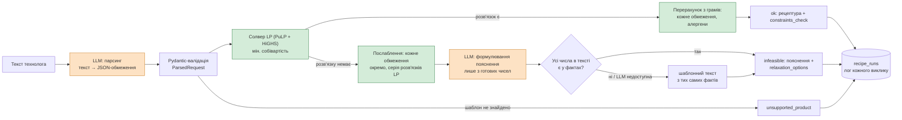

# Recipe under Constraints

Сервіс для технолога харчового виробництва. Технолог описує продукт звичайними словами:

> полуничний йогурт без молока, білка не менше, ніж у звичайного, собівартість до 45 грн за кг,
> і щоб на упаковці можна було написати «зі зниженим вмістом цукру»

Сервіс повертає рецептуру в грамах на 1 кг, де кожне обмеження перевірене числом («вимога vs факт»).
Якщо такої рецептури не існує, сервіс пояснює, чому, і яке **мінімальне** послаблення зробить задачу
розв'язною. Математично це задача лінійного програмування (класична *diet problem*), розв'язується
солвером HiGHS через PuLP.

## Як це працює



**LLM (помаранчеве) бере участь лише на вході й на виході.** На вході вона перетворює текст на
структуровані обмеження (без жодної арифметики, навіть без перерахунку одиниць). На виході вона
переказує готові факти людською мовою. Усі числа (грами, поживність, собівартість, перевірки,
рекомендовані послаблення) рахує детермінований Python (зелене). Пояснення від LLM перевіряє код: кожне число в
тексті має бути серед фактів від солвера, а кожне рекомендоване число має бути згадане. Інакше
повертається шаблонний текст із тих самих фактів.

## Запуск за 3 кроки

Потрібні лише Docker і git. Python на хості не потрібен: усе запускається в контейнері.

```bash
# 1. Клон
git clone https://github.com/Nikita-tg-python/recipe-under-constraints.git
cd recipe-under-constraints

# 2. Ключ LLM (безкоштовний, без банківської картки): https://aistudio.google.com/apikey
cp .env.example .env
#    відкрийте .env і впишіть GEMINI_API_KEY=...
#    (або LLM_PROVIDER=groq і GROQ_API_KEY=... з https://console.groq.com/keys)

# 3. Сервіс + PostgreSQL
make up
curl -s localhost:8000/health    # {"status":"ok","db":"ok","llm_provider":"gemini"}
```

Swagger доступний на <http://localhost:8000/docs>. Якщо порт 8000 зайнятий, додайте `API_PORT=8001` у `.env`,
після чого `make up` відкриє сервіс на `localhost:8001`. Без `make` те саме робить `docker compose up -d --build`.
Без ключа сервіс теж стартує, але `POST /recipe` відповідає `503 llm_not_configured`. Тести ключа не
потребують.

## API: `POST /recipe`

Запит завжди один: `{"request": "текст технолога"}`. Відповідь має три можливі статуси, і на
розпізнаваний вхід сервіс ніколи не повертає 500. Нижче справжні відповіді, скорочені.

### `ok`: рецептура знайдена

```bash
curl -s -X POST localhost:8000/recipe -H 'Content-Type: application/json' -d '{"request":
  "полуничний йогурт без молока, білка не менше, ніж у звичайного, і щоб на упаковці можна було написати «зі зниженим вмістом цукру»"}'
```

```json
{
  "run_id": 4,
  "status": "ok",
  "understood": {"matched_template": "yogurt", "allergens_to_exclude": ["milk"],
                 "protein_constraint": {"mode": "at_least_baseline", "value": null},
                 "sugar_reduced_claim": true, "sugar_reduction_pct": null, "cost_ceiling_uah_per_kg": null, "...": "..."},
  "notes": [],
  "template": "yogurt",
  "recipe_grams": {"soy_milk": 859.479409, "strawberry_prep": 80.0, "sugar": 57.893146,
                   "soy_protein": 2.603799, "vegan_culture": 0.02, "stevia": 0.003646},
  "nutrition_per_100g": {"kcal": 64.2902, "protein_g": 3.0817, "sugar_g": 8.6813, "...": "..."},
  "nutrition_per_kg": {"kcal": 642.902, "...": "..."},
  "sweetness_per_100g": 8.6005,
  "cost_uah_per_kg": 60.1037,
  "allergens": ["soy"],
  "claims_verified": {"reduced_sugar": true},
  "constraints_check": [
    {"constraint": "total", "op": "==", "required": 1000.0, "actual": 1000.0, "unit": "g", "satisfied": true},
    {"constraint": "protein", "op": ">=", "required": 3.0816, "actual": 3.0817, "unit": "g/100 g", "satisfied": true},
    {"constraint": "sugar_reduced_sugar", "op": "<=", "required": 8.6814, "actual": 8.6813, "unit": "g/100 g", "satisfied": true},
    {"constraint": "sugar_reduced_kcal", "op": "<=", "required": 83.8949, "actual": 64.2902, "unit": "kcal/100 g", "satisfied": true},
    {"constraint": "sweetness", "op": ">=", "required": 8.6004, "actual": 8.6005, "unit": "sucrose-eq g/100 g", "satisfied": true},
    {"constraint": "allergens_excluded", "op": "==", "required": 0.0, "actual": 0.0, "unit": "groups present", "satisfied": true},
    "... + category_*_min / category_*_max для кожної категорії шаблону"
  ]
}
```

### `infeasible`: такої рецептури не існує

Саме так сервіс відповідає на приклад з умови задачі. У каталозі звичайний молочний йогурт уже коштує
~50 грн/кг, а всі безмолочні основи дорожчі за молоко, тому 45 грн/кг недосяжні. Сервіс рахує, що
найдешевша рецептура, яка виконує решту вимог, коштує 60,11 грн/кг. Послаблення лише білка або лише
claim не допомагає, тому варіант один.

```bash
curl -s -X POST localhost:8000/recipe -H 'Content-Type: application/json' -d '{"request":
  "полуничний йогурт без молока, білка не менше, ніж у звичайного, собівартість до 45 грн за кг, і щоб на упаковці можна було написати «зі зниженим вмістом цукру»"}'
```

```json
{
  "run_id": 5,
  "status": "infeasible",
  "template": "yogurt",
  "explanation": "Рецептури, що задовольняє всі обмеження одночасно, немає.\nВаріанти послаблення, кожен окремо (решта обмежень як у запиті), від найменшої зміни до найбільшої:\n1. Собівартість: запитано до 45 грн/кг, найдешевша рецептура з рештою обмежень — від 60,11 грн/кг (зміна 33,6 %).",
  "explanation_source": "template",
  "relaxation_options": [
    {"constraint": "cost_ceiling_uah_per_kg", "requested": 45.0, "minimal_feasible": 60.11,
     "relative_change": 0.3358, "cost_uah_per_kg": 60.1037, "recipe_grams": {"soy_milk": 859.479409, "...": "..."}}
  ],
  "blocking_reasons": []
}
```

У кожній відповіді є `understood` (які обмеження отримав солвер) і `notes` (що LLM витлумачила або
не змогла застосувати). Приклад такої примітки: «"безлактозний" не виключає молоко: безлактозних
інгредієнтів у каталозі немає». Жодна вимога не губиться мовчки.

`relaxation_options` відсортовані від найменшої відносної зміни, і кожен варіант містить свою
перевірену рецептуру. Поле `explanation_source` показує, хто сформулював текст. Зазвичай це `llm`: модель
переказує ті самі числа своїми словами, наприклад «…замість запитаних до 45 грн/кг найдешевша
рецептура з рештою обмежень коштує від 60,11 грн/кг…». Значення `template` означає, що LLM була
недоступна або її текст не пройшов перевірку чисел. У прикладі вище Gemini відповів 504, тому
показано шаблонний текст.

### `unsupported_product`: продукт поза шаблонами

```bash
curl -s -X POST localhost:8000/recipe -H 'Content-Type: application/json' -d '{"request": "шоколадний торт без глютену"}'
```

```json
{
  "run_id": 3,
  "status": "unsupported_product",
  "product_type": "шоколадний торт",
  "explanation": "Немає відповідного шаблону для шоколадного торта. Сервіс складає рецептури лише для: Йогурт фруктовий (полуничний), Злаковий батончик (гранола-бар), Хліб пшеничний.",
  "supported_templates": {"yogurt": "Йогурт фруктовий (полуничний)", "granola_bar": "Злаковий батончик (гранола-бар)", "bread": "Хліб пшеничний"}
}
```

### Помилки

Усі помилки мають спільний формат `{"error": {"code": "...", "message": "..."}}`:
- порожній текст, запит без поля `request` або довший за 2000 символів → `422 validation_error`;
- LLM недоступна → `502 llm_error` або `503 llm_unavailable` / `llm_not_configured`.

Кожен виклик, зокрема невдалий, записується в таблицю `recipe_runs`: текст запиту, розібрані обмеження,
статус, повна відповідь і тривалість.

```bash
docker compose exec db psql -U recipe -d recipe -c "SELECT id, status, matched_template, duration_ms FROM recipe_runs ORDER BY id"
```

## Доказ: `make proof`

Умова задачі вимагає не лише зелених тестів, а доказу, що рецептури справді відповідають запиту.
Цей доказ дає `eval/proof.py`. Він проганяє 11 запитів з `eval/requests.jsonl`: приклад з умови,
кілька алергенів одночасно, явну недосяжність і непідтримуваний продукт. Кожен запит іде через
`POST /recipe` з живою LLM, після чого скрипт **сам** перевіряє відповідь:

- нічого не імпортує з солвера: поживність, собівартість і алергени перераховує із сирих
  `data/*.yaml` власною арифметикою;
- полю `satisfied` не довіряє, кожен пункт `constraints_check` перераховує;
- звіряє рецептуру з **очікуваннями, записаними в `requests.jsonl` вручну**, а не з тим, як LLM
  зрозуміла запит. Якщо модель «загубить» «без сої», доказ впаде;
- для `infeasible` перевіряє кожен варіант послаблення як повноцінну рецептуру з послабленим
  обмеженням; рекомендоване число має бути згадане в поясненні.

```bash
make proof                                 # у процесі, з LLM із .env
make proof ARGS="--url http://api:8000"    # проти запущеного `make up` (прогони потраплять у recipe_runs)
make proof ARGS="--only bread_protein_20"  # окремі запити (звіт не перезаписується)
```

Як читати вивід:

```
| request                 | expected   | got        | checks | result | summary                               |
| task_example            | infeasible | infeasible | 22/22  | PASS   | cost_ceiling_uah_per_kg: 45.0 → 60.11 |
| task_example_no_ceiling | ok         | ok         | 38/38  | PASS   | 60.10 UAH/kg, protein 3.08 g/100 g    |
...
11/11 pass; report: eval/proof_report.md
```

- `expected` / `got` — очікуваний і фактичний статус. Для негативних кейсів очікується саме
  `infeasible` чи `unsupported_product`, і це перевіряється.
- `checks` — скільки незалежних перевірок пройшло: сума 1000 г, межі категорій, вільність від
  алергенів, білок, claim, стеля ціни, збіг звітованих чисел із перерахованими.
- Якщо щось не пройшло, під таблицею з'являється список `Failed checks`, а код виходу стає 1.
- Повний перелік перевірок по кожному запиту записується в `eval/proof_report.md`. Там же лежить
  закомічений звіт останнього прогону.

Що харнес справді ловить неправду, доводять тести `tests/test_proof.py`. У них у відповідь навмисно
вносяться підробки: сума ≠ 1000, хибний `satisfied`, алерген із запиту в рецептурі, неправдиві
поживні значення, неправдива рекомендація ціни.

## Команди

| Команда | Що робить |
|---|---|
| `make up` / `make down` | сервіс і PostgreSQL (docker compose) |
| `make build` | перезібрати образ (після зміни залежностей) |
| `make test` | pytest: без мережі й ключів LLM (FakeLLM), ~3 с |
| `make lint` | ruff check + format --check |
| `make proof` | харнес доказу (див. вище) |
| `docker compose run --rm api python -m app.seed` | завантажити каталог у БД (upsert, ідемпотентно) |
| `docker compose run --rm --no-deps api python -m app.parsing "текст"` | лише парсинг: що зрозуміла LLM |

## Припущення

Умова задачі не дає уточнювати деталі в рантаймі. Тому все неочевидне вирішено явно, і кожне
рішення нижче звірено з кодом.

**Продукти й каталог** (`data/*.yaml`, `app/schemas.py`)
- Підтримуються 3 шаблони продукту: фруктовий (полуничний) йогурт, злаковий батончик (гранола-бар) і
  пшеничний хліб. Шаблон задає категорії інгредієнтів з межами в грамах (`category_bounds`), тож
  рецептура лишається впізнаваною. «Звичайний» продукт для порівнянь — це `base_recipe` шаблону.
- Каталог має 50 інгредієнтів. Рецептура рахується в грамах на 1 кг суміші до термообробки,
  усушку при випіканні не моделюємо.
- Поживність вказано на 100 г за правилами ЄС 1169/2011: вуглеводи без клітковини, поліоли не є
  цукрами, еритрит має 0 ккал, алюлоза рахується як цукор. Значення довідкові й округлені (USDA /
  типові етикетки).
- Солодкість задано в сахарозному еквіваленті (цукор = 100). Це груба сенсорна оцінка.
- **Ціни вигадані**, але правдоподібні для малого українського виробника у 2026 році. Звідки взявся
  порядок величин, пояснює поле `price_source` кожного інгредієнта. Це не ринкові дані.
- Солвер бере каталог з валідованих YAML. Копія в PostgreSQL (`python -m app.seed`) потрібна для SQL-аналізу.

**Розуміння запиту** (`app/parsing.py`)
- LLM лише виписує факти з тексту. Нічого не рахує й не перераховує одиниці. Температура 0; на
  невалідний JSON робиться 1 повторна спроба з описом помилки.
- «Білка не менше N г» означає г на 100 г продукту. «Не менше, ніж у звичайного» означає білок ≥
  білка в `base_recipe`. «Підвищений білок» без числа читається так само («не менше, ніж у
  звичайного»), і про це з'являється примітка в `notes`.
- «На N % менше цукру» задає жорстку межу: цукор ≤ (100 − N) % від звичайного продукту
  (`sugar_reduction_pct`). «Вдвічі менше» означає N = 50; це єдине дозволене перетворення слова на
  число, інші формулювання йдуть у `notes`. Claim «зі зниженим вмістом цукру» — окрема вимога, і
  обидві можуть діяти разом.
- Стеля ціни приймається лише в грн/кг. Ціна в інших одиницях (за 100 г, за упаковку) не
  конвертується, а потрапляє в `notes`.
- «Без молока», «веганський», «на рослинній основі» → виключити `milk`. «Безлактозний» молоко **не**
  виключає, а безлактозних інгредієнтів у каталозі немає, тому сервіс дає звичайну рецептуру з
  приміткою в `notes`. «Без горіхів» стосується деревних горіхів (`nuts`); арахіс (`peanuts`) виключається, лише
  якщо його названо. 14 груп алергенів відповідають додатку II до Reg. (EU) 1169/2011.
- Продукт поза шаблонами дає відповідь `unsupported_product` з причиною. Сервіс не намагається
  «вгадати» найближчий шаблон.

**Claim «зі зниженим вмістом цукру»** (`app/claims.py`, див. «Джерело regulatory-правила»)
- Цукор ≤ 70 % від звичайного продукту **і** енергія (ккал) ≤ звичайного продукту, обидва значення
  на 100 г. Рівно 30 % зниження проходить.
- Якщо у звичайному продукті цукру немає, claim неможливий.

**Солвер** (`app/solver.py`)
- Серед усіх допустимих рецептур обирається **найдешевша**: цільова функція — мінімальна
  собівартість, навіть коли стелю ціни не задано. Так відповідь детермінована й пояснювана.
- Коли цукор знижується (claim або «на N % менше»), додатково вимагається, щоб солодкість була не
  нижча, ніж у звичайного продукту: продукт має лишатися солодким, тож цукор замінюється
  підсолоджувачем.
- Солвер — HiGHS, а не CBC, який іде в комплекті з `pulp[cbc]`. На репетиції KAN-50 з'ясувалося,
  що той CBC — devel-збірка: його попереднє звуження меж хибно «доводило» недосяжність
  здійсненної LP-задачі.
- Грами повертаються з точністю 1 мкг, бо стевію кладуть у міліграмах на кілограм.
- Межі поживних речовин і ціни LP тримає з запасом 1e-4, щоб перерахунок з повернутих грамів
  проходив строго, а не «майже». Статусу солвера код не довіряє: усі обмеження й алергени
  перераховуються з грамів (`constraints_check`).

**Недосяжність** (`app/relax.py`, `app/explain.py`)
- Кожне обмеження користувача послаблюється **окремо**, решта лишаються як у запиті:
  - білок — вниз (бінарний пошук);
  - «на N % менше цукру» — вниз (бінарний пошук);
  - стеля ціни — вгору;
  - claim — зняти.
- **Виключення алергенів не послаблюються ніколи**: вони захищають споживача, це не побажання.
- Рекомендоване число округлюється до 0,01 у безпечний бік і підтверджується справжнім розв'язком.
  Через запас LP межа, що лежить рівно на максимумі, показується на крок нижче (0,99 замість 1,0).
- Якщо жодне окреме послаблення не допомагає, `blocking_reasons` пояснює чому. Наприклад,
  виключений алерген спустошує обов'язкову категорію шаблону. Якщо допомагає лише комбінація,
  сервіс називає межу кожної вимоги окремо: «білок — не більше 11,53 г на 100 г (запитано 15);
  собівартість — від 37,81 грн/кг (запитано до 10)».

**API і лог** (`app/routers/recipe.py`, `app/runs.py`)
- `recipe_runs` пише кожен виклик `POST /recipe`, зокрема збої LLM (`status=error`). Якщо запис у
  БД не вдався, відповідь усе одно повертається з `run_id: null`.

## Джерело regulatory-правила

Claim «зі зниженим вмістом цукру» / *reduced sugars* реалізовано в `app/claims.py` за такими актами:

- [Regulation (EC) No 1924/2006](https://eur-lex.europa.eu/eli/reg/2006/1924/oj) on nutrition and
  health claims made on foods, Annex, «REDUCED [NAME OF THE NUTRIENT]». Вміст поживної речовини має
  бути знижений щонайменше на 30 % порівняно з подібним продуктом.
- [Regulation (EU) No 1047/2012](https://eur-lex.europa.eu/eli/reg/2012/1047/oj) додала для
  *reduced sugars* другу умову: енергетична цінність продукту з claim дорівнює енергетичній цінності
  подібного продукту або менша за неї.
- Україна: наказ МОЗ від 15.05.2020 № 1145, додаток 1, п. 23 «Зменшена кількість [назва поживної
  речовини]». Там ті самі 30 % і та сама умова щодо енергії.

«Подібний продукт» у сервісі — це `base_recipe` шаблону.

## Відомі обмеження

- Безкоштовний тариф Gemini іноді відповідає 429/503/504 або не встигає. На кожен виклик є 20 с і до
  двох повторів (найгірший випадок близько 67 с). Якщо не вдалося, парсинг повертає
  `503 llm_unavailable`, а пояснення переходить на шаблонний текст (`explanation_source: "template"`).
- Послаблення рахуються по одному обмеженню. Якщо допомагає лише комбінація, сервіс називає межу
  кожної вимоги окремо, але конкретну пару «білок X + ціна Y» не підбирає.
- «Підвищений білок» без числа не перетворюється на регуляторний claim «джерело білка» / «високий
  вміст білка» (Reg. 1924/2006: ≥ 12 % / ≥ 20 % енергії з білка). Він читається як «не менше, ніж у
  звичайного», з приміткою.
- Лактозу окремо не моделюємо: немає поля «лактоза» і немає безлактозних інгредієнтів. На
  «безлактозний» сервіс відповідає звичайною рецептурою з приміткою, а не відмовою.
- Каталог і ціни — модельні дані, не сертифікована база продуктів.

## Що б зробив далі

1. **Більше шаблонів продукту** і шаблони з даних: технолог описує категорії та межі, а не
   програміст.
2. **М'які й пріоритезовані обмеження** замість жорстких (goal programming: штраф за кожне
   відхилення з вагою пріоритету). Тоді відповідь на недосяжний запит — найкращий компроміс, а на
   додачу мінімальні **комбінації** послаблень (Парето-фронт «ціна ↔ білок»).
3. **Текстура і смак як додаткові фактори**: частка сухих речовин і стабілізатора для в'язкості,
   профіль солодкості (гіркота стевії обмежує її частку), кислотність. Спершу як лінійні обмеження,
   далі як сенсорна модель.
4. **Реальні ціни й склад** з ERP/закупівель замість вигаданих, з датою ціни у відповіді.
5. **Більше регуляторних claims**: «джерело білка» / «високий вміст білка», «безлактозний» (з лактозою
   як нутрієнтом і безлактозними інгредієнтами), «без додавання цукру».
6. **Експлуатація**: кеш відповідей LLM, окремий prod-образ без dev-залежностей і від
   непривілейованого користувача, метрики за `recipe_runs`.

## Структура

```
app/
  main.py       # FastAPI: lifespan (пул БД, міграції, каталог, LLM), /health
  routers/      # POST /recipe
  pipeline.py   # спільний пайплайн: парсинг → солвер → послаблення → пояснення
  parsing.py    # LLM: текст → ParsedRequest
  claims.py     # правило reduced sugar
  solver.py     # LP + перерахунок-доказ із грамів
  relax.py      # недосяжність → мінімальне послаблення
  explain.py    # LLM: пояснення лише з фактів, перевірка чисел
  runs.py       # лог recipe_runs
  llm/          # LLMClient: gemini, groq, fake (тести)
data/           # ingredients.yaml (50), templates.yaml (3)
migrations/     # SQL, ідемпотентні, застосовуються на кожному старті
eval/           # requests.jsonl, proof.py, proof_report.md
tests/          # тести без мережі й ключів
```
